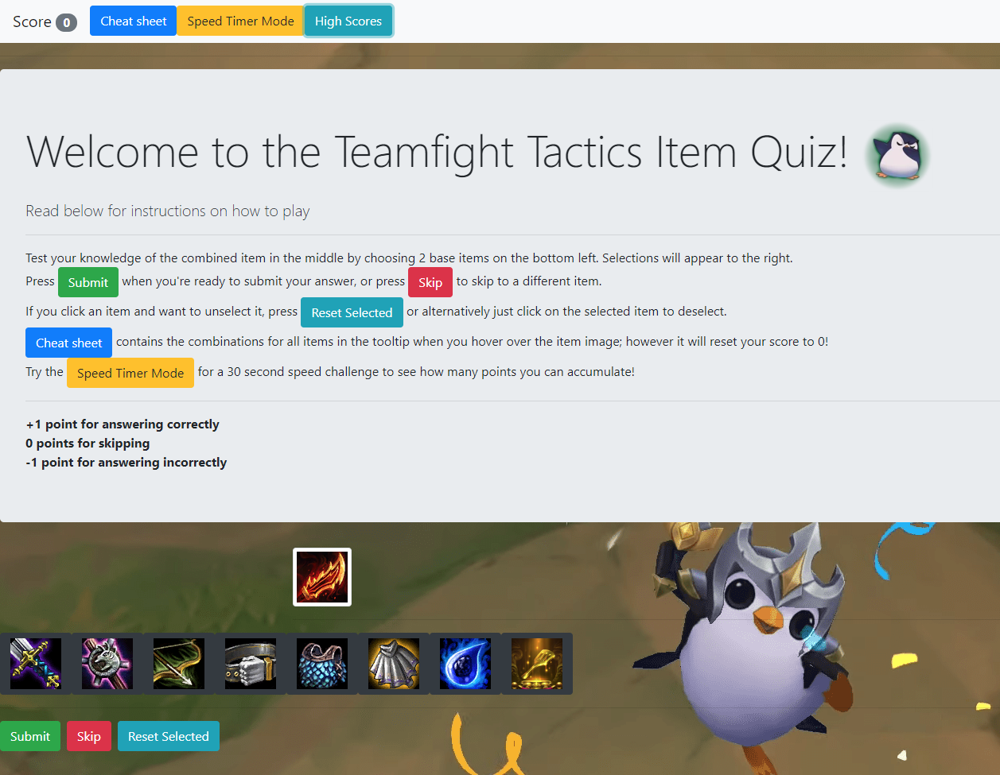

# tft-quiz
 
Teamfight Tactics is a game mode released on the League of Legends client by Riot Games. It is a round-based strategy game that pits you against seven opponents in a free-for-all race to build a powerful team that fights on your behalf.
 
This quiz game is designed to help players memorize the 36 different item combinations from the game in a fun and interactive way!

https://tft-quiz.herokuapp.com/

